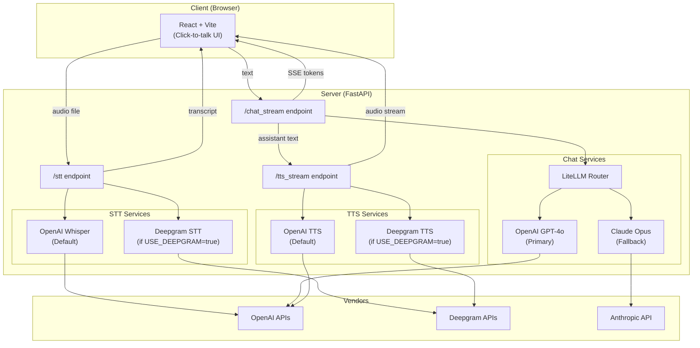

# Voice-Therapist Backend

FastAPI application providing STT ↔ GPT-4o ↔ TTS glue for the Voice-Therapist MVP.

---

## 1 Architecture



Directory layout:

```
voice-therapist-server/app
├─ main.py          ← declares HTTP endpoints (/stt, /chat_stream, /tts_stream, /health)
├─ services/        ← whisper, chat (LiteLLM), TTS wrappers
└─ infra/
   └─ config.py     ← typed env-loader (Pydantic)
```

## 2 Quick-start (local)

```bash
# 1. clone repo
cd voice-therapist-server

# 2. create .env with your keys
cp .env.example .env
echo "OPENAI_API_KEY=sk-…"      >> .env
echo "ANTHROPIC_API_KEY=sk-…"   >> .env

# 3. install deps (requires Python ≥3.10)
python -m venv .venv && source .venv/bin/activate
pip install -e .

# 4. run dev server
./scripts/dev.sh        # http://localhost:9000/docs
```

## 3 Docker

```bash
# Build & run container (port 9000)
docker build -f Dockerfile -t voice-therapist-server .
docker run -p 9000:9000 --env-file .env voice-therapist-server
```

## 4 Endpoints

| Endpoint | Payload |
|----------|---------|
| `POST /stt` | multipart `speech.webm`, `session_id` (form-data) |
| `POST /chat_stream` | `{ "text": "hi", "session_id": "uuid" }` |
| `POST /tts_stream` | `{ "text": "hello" }` |