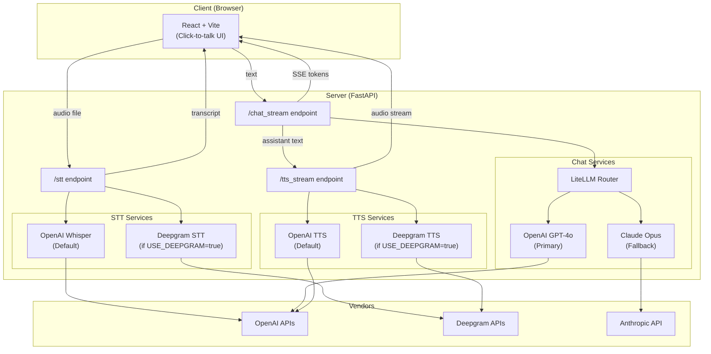

# Voice-Therapist – Current System Architecture

## 1. High-level Overview
The MVP consists of a React front-end (`voice-therapist-ui`) and a FastAPI back-end (`voice-therapist-server`).

Communication happens over HTTP:

* `POST /stt` – upload recorded audio (`multipart/form-data`) and receive a JSON transcript.
* `POST /chat_stream` – send the transcript and receive a **Server-Sent Events** (SSE) stream of GPT tokens.
* `POST /tts_stream` – send the assistant text and receive a streaming MP3 audio response.

A unified WebSocket is planned but **not yet implemented**.

## 2. Component Diagram

## 3. Turn-by-Turn Flow
1. User presses Mic button; the browser listens to the audio using microphone and, on silence of 2 seconds, posts the blob to `/stt`.
2. The backend stores the file and calls Whisper, returning the transcript.
3. The transcript is posted to `/chat_stream`; assistant tokens stream back over SSE.
4. The completed assistant reply is then posted to `/tts_stream`.
5. The browser receives audio chunks and plays them gap-less.
6. Cycle repeats for the next turn.

## 4. Resilience & Security
* CORS is open in development; restrict allowed origins in production.
* API keys are provided via environment variables loaded in `infra/config.py`. 
* Alot more measure will be taken like handling of temporary data storage of audio and cleaning up right after, encryption of traffic being passed through.
