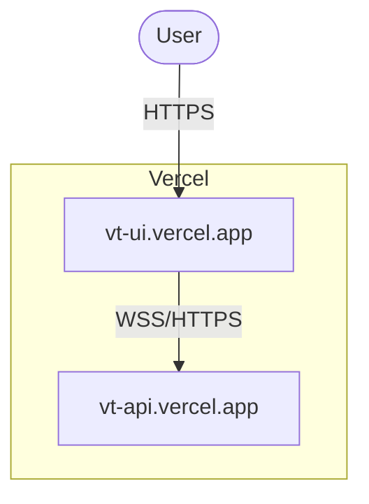

# Deployment Guide – Voice Therapist

This guide explains how to deploy the UI and API in production (Vercel-based example, but easily transferable).

## 1. Prerequisites
* Vercel account
* OpenAI & Anthropic API keys
* Docker installed locally (for manual build)

----

## 2. FastAPI Backend on Vercel
1. **Directory** – `voice-therapist-server/`
2. **Vercel Config** – already present as `vercel.json`:
   ```json
   {
     "version": 2,
     "builds": [
       { "src": "api/index.py", "use": "@vercel/python" }
     ],
     "routes": [
       { "src": "/(.*)", "dest": "/api/index.py" }
     ]
   }
   ```
3. **Data directory** – code switches to `DATA_DIR=/tmp` when `VERCEL=1` env flag is present.
4. **Deploy Steps**
   ```bash
   cd voice-therapist-server
   vercel deploy --prod -e OPENAI_API_KEY=sk-… -e ANTHROPIC_API_KEY=sk-… \
                  -e VERCEL=1
   ```
5. **Result** – API reachable at `https://example-therapist-server.vercel.app`.

---
## 3. React UI on Vercel (Static)
1. **Directory** – `voice-therapist-ui/`
2. **Build Output** – Vercel detects `vite` and runs `pnpm build`, output in `dist/`.
3. **Environment Variable** – expose `VITE_API_BASE` if API domain differs.
4. **Deploy**
   ```bash
   cd voice-therapist-ui
   vercel deploy --prod -e VITE_API_BASE="https://example-therapist-server.vercel.app" easier with the vercel dashboard itself
   ```
5. **Custom Domain & HTTPS** – configure in Vercel dashboard.

---

## 4. Infrastructure Diagram


---
